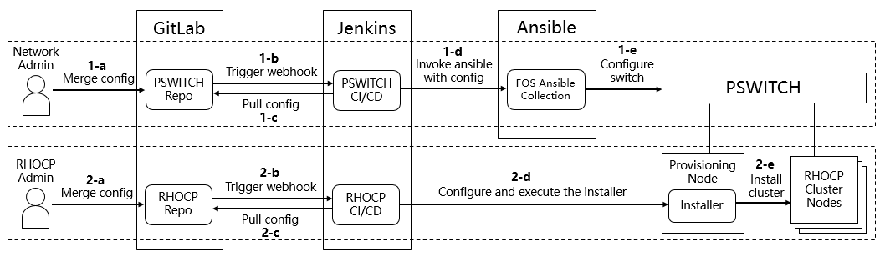

# Automatic PSWITCH Configuration and RHOCP Installation with GitOps

This project aims to introduce a method to automate the process of PSWITCH configuration and RHOCP installation through GitOps. The GitOps is an operational framework, which focuses on an administrator-centric experience when operating infrastructure by using widely known tools such as GitLab and Jenkins.

With the configuration information of your infrastructure stored in a version control system, and serving as your canonical source of truth, you have a single place from which everything is derived and driven, so that the process of provisioning and managing infrastructure can be defined as code, allowing code merge triggers continuous deployment tools do the actual deployment. Compared to traditional infrastructure deployment methods, this will bring advantages in the following points:

- The Git version control system enhances security, allows for rollback to previous versions if any incidents happened, which can reduce downtime.
- Automation improves administrator experience and increases efficiency.
- The clear change history in Git tree brings natural audit trail.

Please note that the GitOps approach here does not adopt a declarative mechanism to maintain the state of configured resources, so it is limited to the initial deployment of the infrastructure.

## Prerequisites

The verified supported platforms are as follows:

- FUJITSU PSWITCH 2048T with runtime version 1.3.67.
- FUJITSU PRIMERGY RX2530 M4 servers and above.
- iRMC version 3.05P and above.
- RHOCP 4.9.5 and above within 4.9 release. (Note: 4.10 release is not yet supported.)

## Overall Architecture and Operation Process

The implementation is mainly composed of three components, which are Gitlab, Jenkins and Ansible. For ease of management, these are usually installed on three VMs on a physical machine. The parts that network administrators and cluster administrators can control are isolated from each other by different git repositories.

### Component Introduction

- GitLab: The versioned storage for configuration information as a single source of truth.
- Jenkins: The continuous deployment tool for performing actual infrastructure deployments.
- Ansible: Use various Ansible content to help automate the management of Fujitsu PSWITCH.

### Process Explanation

Prior to this process, network administrators and cluster administrators should share information with each other about which servers to use and how to set up VLANs for the switch ports those servers are connected to, and have the necessary configuration files and scripts ready in advance. Then the network administrator configures the network first, the cluster administrator deploys RHOCP later.

1. This part is for the network infrastructure and should be managed by the network administrator.

    a. Network administrator merges or pushes the PSWITCH configurations to the repository on GitLab.

    b. GitLab triggers the continuous deployment operation on Jenkins through webhook.

    c. Jenkins pulls the repository and references the configurations in it to execute the build scripts pre-programmed on Jenkins by the administrator.

    d. The build script calls the Ansible tools to configure the PSWITCH.

    e. The Ansible tools with the plugin called [ansible-collection-for-fos](https://github.com/fujitsu/ansible-collection-for-fos) actually complete the configuration of the PSWITCH.

2. This part is for the RHOCP cluster deployment and should be managed by the RHOCP administrator.

    a. RHOCP administrator merges or pushes the RHOCP configurations to the repository on GitLab.

    b. GitLab triggers the continuous deployment operation on Jenkins through webhook.

    c. Jenkins pulls the repository and references the configurations in it to execute the build scripts pre-programmed on Jenkins by the administrator.

    d. The build script configures and executes the installer to deploy the RHOCP cluster.

    e. The RHOCP installer actually complete the deployment of the RHOCP cluster.

## Environment Build Instructions

1. [Gitlab Installation and Configuration](docs/01-gitlab-installation.md)
2. [Jenkins Installation and Configuration](docs/02-jenkins-installation.md)
3. [Ansible Installation and Configuration](docs/03-ansible-installation.md)
4. [Automation Configuration](docs/04-automation-configuration.md)
